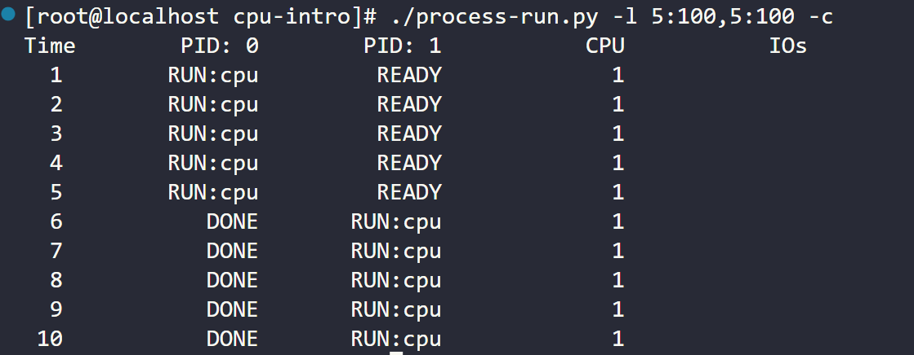
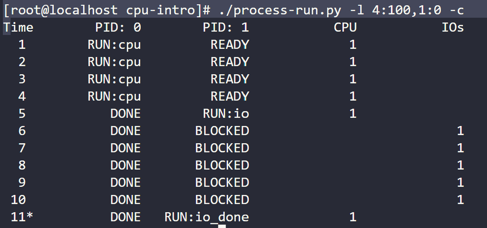
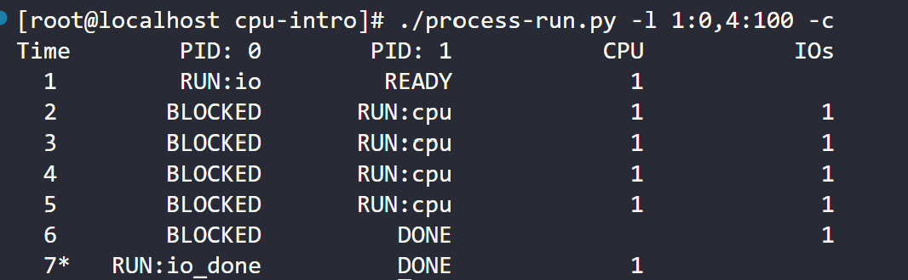
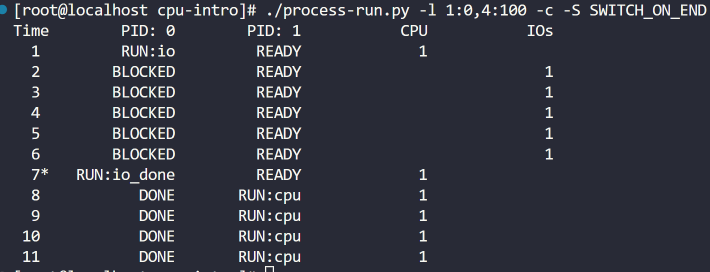
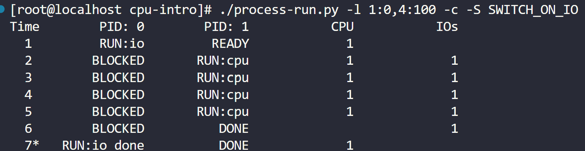
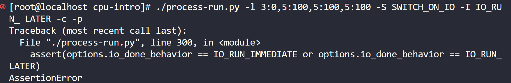
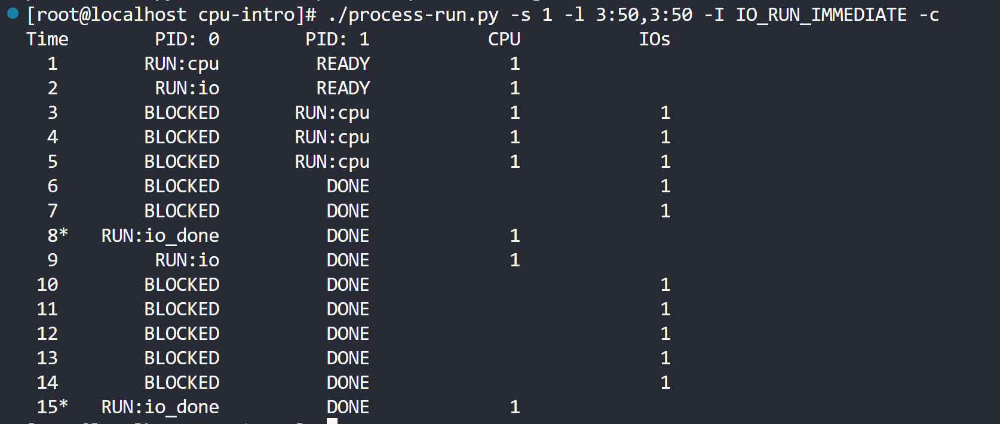
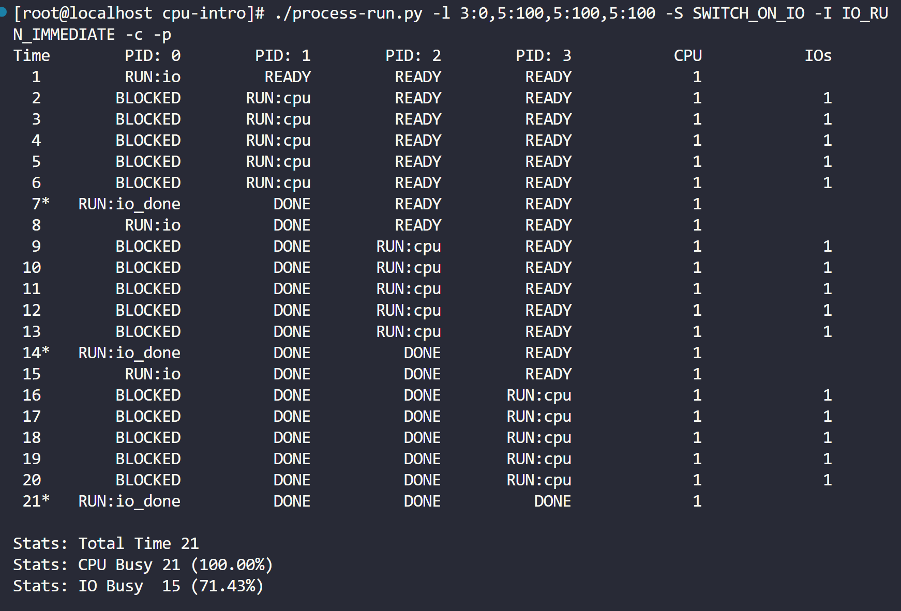
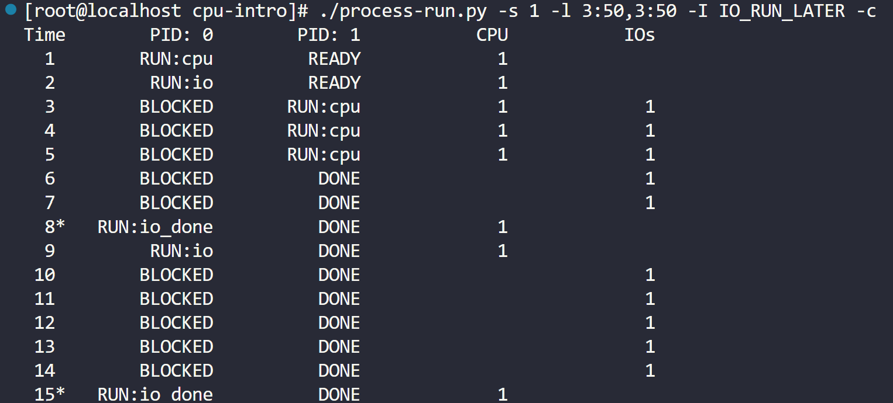

# 问题

**1．用以下标志运行程序：./process-run.py -l 5:100,5:100。CPU 利用率（CPU 使用时间 的百分比）应该是多少？为什么你知道这一点？利用 -c 标记查看你的答案是否正确。**

​	利用率为100%,cpu一直被进程占用

**2．现在用这些标志运行：./process-run.py -l 4:100,1:0。这些标志指定了一个包含 4 条指令的进程（都要使用 CPU），并且只是简单地发出 I/O 并等待它完成。完成这两个进程需要 多长时间？利用-c 检查你的答案是否正确。**

进程0执行4个指令的时间,进程1在进程0执行完成后执行i/o的时间,等待I/O完成的时间

**3．现在交换进程的顺序：./process-run.py -l 1:0,4:100。现在发生了什么？交换顺序是否 重要？为什么？同样，用-c 看看你的答案是否正确。**

进程0在进行I/O时从运行变为阻塞,此时进程1占用cpu

**4．现在探索另一些标志。一个重要的标志是-S，它决定了当进程发出 I/O 时系统如何 反应。将标志设置为 SWITCH_ON_END，在进程进行 I/O 操作时，系统将不会切换到另一 个进程，而是等待进程完成。当你运行以下两个进程时，会发生什么情况？一个执行 I/O，另一个执行 CPU 工作。（-l 1:0,4:100 -c -S SWITCH_ON_END）**

在进程0执行完一次完整的I/O操作后,进程1才开始占用cpu.此时进程0在处于阻塞状态时进程1一直处于就绪态.

**5．现在，运行相同的进程，但切换行为设置，在等待I/O 时切换到另一个进程（-l 1:0,4:100 -c -S SWITCH_ON_IO）。现在会发生什么？利用-c 来确认你的答案是否正确。**

在进程0执行I/O时,进程1占用cpu从就绪态转为运行态.并在进程1完成后且进程0的I/O完成时,进程0不再阻塞.

**6．另一个重要的行为是 I/O 完成时要做什么。利用-I IO_RUN_LATER，当 I/O 完成时， 发出它的进程不一定马上运行。相反，当时运行的进程一直运行。当你运行这个进程组合 时会发生什么？（./process-run.py -l 3:0,5:100,5:100,5:100 -S SWITCH_ON_IO -I IO_RUN_LATER -c -p）系统资源是否被有效利用？**

系统资源无法被有效利用.I/O操作完成输入后,此时进程1处于完成态,进程2应由就绪态转为运行态.(ASSERT条件都为false    此时I/O操作完后的行为要么是立即运行,要么是一会运行.在实际中这两个条件都不符合).

**7．现在运行相同的进程，但使用-I IO_RUN_IMMEDIATE 设置，该设置立即运行发出 I/O 的进程。这种行为有何不同？为什么运行一个刚刚完成 I/O 的进程会是一个好主意？**

避免在其他进程处于运行态时,进程0从就绪态转为运行态抢占cpu.

8．现在运行一些随机生成的进程，例如-s 1 -l 3:50,3:50, -s 2 -l 3:50,3:50, -s 3 -l 3:50,3:50。 看看你是否能预测追踪记录会如何变化？当你使用-I IO_RUN_IMMEDIATE 与-I IO_RUN_
LATER时会发生什么？当你使用-S SWITCH_ON_IO与-S SWITCH_ON_END时会发生什么？

